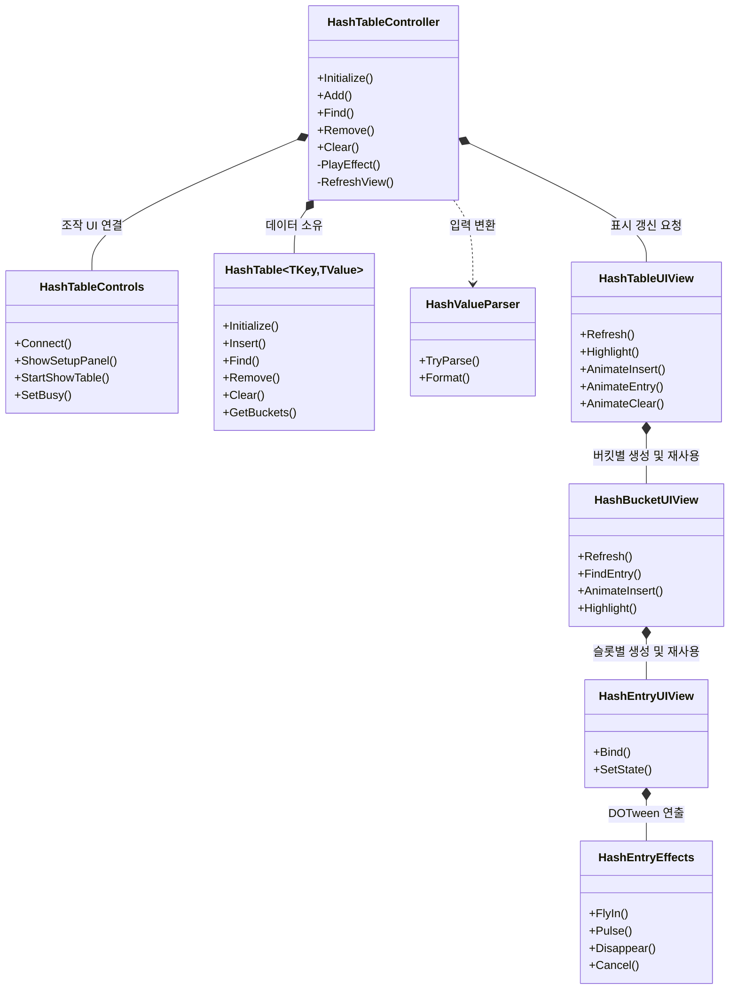
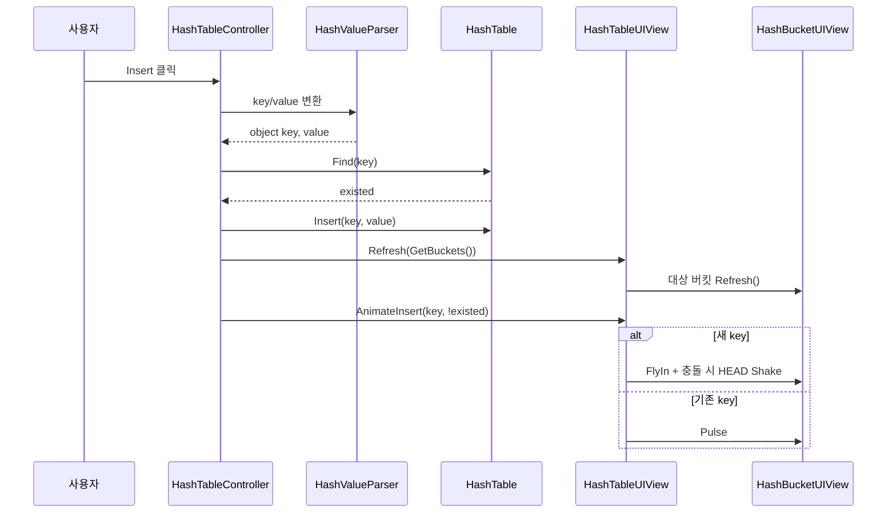

# HashTable UI 구조

`HashTableScene`에서 사용자가 key/value 타입을 선택한 뒤 HashTable을 조작하고, Separate Chaining 구조와 결과 연출을 화면에 표시한다.

## 클래스 관계



## 클래스별 역할

| 클래스 | 역할 | 소유하거나 처리하는 것 |
| --- | --- | --- |
| `HashTableController` | 데이터 조작의 시작점 | 타입 선택 결과, `HashTable<object, object>`, 조작 잠금, 연출 완료 후 UI 갱신 |
| `HashTableControls` | 입력과 버튼 UI | 타입 드롭다운, key/value 입력, 버튼 이벤트 연결, 연출 중 버튼 비활성화 |
| `HashValueParser` | 입력값의 공통 변환 | `int`, `float`, `string` 변환 및 `NaN`/무한대 거부 |
| `HashTable<TKey, TValue>` | 실제 해시 테이블 | 버킷 배열, Separate Chaining, 중복 key 값 갱신, 75% 부하율 rehash |
| `HashTableUIView` | 전체 버킷 화면 | 용량에 맞는 `HashBucketUIView` 확보, 대상 버킷 탐색, 전체 연출 제어 |
| `HashBucketUIView` | 한 버킷의 체인 화면 | `HEAD`, `EntryLayoutRoot`의 고정 슬롯, 충돌 셰이크, entry 재사용 |
| `HashEntryUIView` | 한 key/value의 표시 | key, value, next 포인터 텍스트 및 검색 상태 색 |
| `HashEntryEffects` | 한 entry의 DOTween 연출 | 삽입 이동, 검색/값 갱신 pulse, 삭제 축소·페이드, 중단 시 원상 복구 |

## 데이터와 UI의 경계

`HashTable`이 key, value, 버킷 위치, 연결 순서를 결정하는 유일한 데이터 소유자다. UI는 `GetBuckets()`가 전달한 결과를 그릴 뿐 `Next` 포인터나 해시 계산을 변경하지 않는다.

```text
HashTableController
    -> HashTable 조작
    -> GetBuckets()
    -> HashTableUIView.Refresh()
    -> HashBucketUIView.Refresh()
    -> HashEntryUIView.Bind()
```

`HashBucketUIView`는 entry가 사라져도 슬롯과 UI 인스턴스를 바로 파괴하지 않는다. 남는 slot을 비활성화해 Layout Group에서 제외하고, 다음 삽입에 다시 사용한다. 따라서 entry 개수가 바뀌어도 슬롯 크기와 간격은 고정된다.

## Insert



- 새 key는 `HEAD` 근처에서 생성된 뒤 `EffectRoot`를 통해 목표 slot까지 이동한다.
- 실제 slot은 `EntryLayoutRoot`에 남아 있어 연출 중에도 고정 자리를 점유한다.
- 기존 key는 value만 갱신하고 해당 entry를 확대·밝게 하는 `Pulse`를 재생한다.
- 연출 중 `IsBusy`와 `SetBusy(true)`가 다음 조작을 막는다. 입력값은 작성할 수 있지만 Insert, Find, Remove, Clear는 실행되지 않는다.

## Find

```text
Find 클릭
    -> key 변환
    -> HashTable.Find()
    -> 전체 highlight 해제
    -> 찾은 entry만 Found 상태로 변경
    -> Pulse: 확대 + 흰색 플래시 + 원래 색 복귀
```

찾지 못하면 highlight만 해제하고 피드백 텍스트에 `Key not found.`를 표시한다.

## Remove와 Clear

```text
Remove
    -> HashTable에서 먼저 제거
    -> 기존 entry는 Disappear: 확대 -> 회전·축소·페이드
    -> 연출 완료
    -> RefreshView()로 slot 재정렬

Clear
    -> HashTable.Clear()
    -> 화면의 모든 entry가 Disappear를 동시에 재생
    -> 연출 완료
    -> RefreshView()로 모든 bucket의 entry 제거
```

데이터는 먼저 변경하지만, 삭제 UI는 연출이 끝난 뒤 갱신한다. 연출 대상을 찾지 못해 Tween이 없으면 `PlayEffect()`가 즉시 `RefreshView()`를 호출해 데이터와 화면의 불일치를 막는다.

## 타입 입력 규칙

| 선택 타입 | InputField 규칙 | 최종 검증 |
| --- | --- | --- |
| `int` | `IntegerNumber`: 숫자와 음수 기호만 입력 | `int.TryParse()` |
| `float` | `DecimalNumber`: 숫자, 음수 기호, 소수점 입력 | `float.TryParse()`, `NaN`/무한대 거부 |
| `string` | `Standard`: 입력 제한 없음 | `null`이면 빈 문자열 저장 |

`InputField.contentType`은 입력 중 잘못된 문자를 막는 UX 계층이다. 붙여넣기 등으로 들어온 값까지 포함한 최종 검증은 `HashValueParser.TryParse()`가 담당한다.

## 키보드 조작

- 테이블 시작 시 기본 조작은 Insert이며 Key 입력란에서 편집을 시작한다.
- Enter 또는 숫자 키패드 Enter는 마지막으로 선택한 조작 버튼을 실행한다. 입력란으로 돌아가도 해당 버튼의 강조색과 선택은 유지된다.
- Tab은 Key → Value → Insert → Find → Remove → Clear 순서로 순환한다. Shift+Tab은 역순이며, 버튼에 도착하면 해당 조작을 선택한다. 마우스로 버튼을 클릭해도 선택이 갱신된다.
- 연출 중에는 Enter를 무시하고 Tab으로 잠긴 버튼을 건너뛴다. 입력을 예약하거나 연출 종료 후 재실행하지 않는다.

`HashTableControls`가 기존 Inspector 참조로 탐색 순서와 강조색을 구성하므로 추가 씬 연결은 필요 없다. 조작 화면에서는 EventSystem의 기본 탐색/Submit을 잠시 끄고 Tab/Enter를 직접 처리해 중복 실행을 막는다. 입력란의 문자 편집 이벤트는 계속 전달되며, 설정 화면이나 컴포넌트 비활성화 시 기존 탐색 설정을 복원한다.

## 관련 파일

- `Assets/_Scripts/HashTableController.cs`
- `Assets/_Scripts/HashTable.cs`
- `Assets/_Scripts/HashValueParser.cs`
- `Assets/_Scripts/UI/HashTable/HashTableControls.cs`
- `Assets/_Scripts/UI/HashTable/HashTableUIView.cs`
- `Assets/_Scripts/UI/HashTable/HashBucketUIView.cs`
- `Assets/_Scripts/UI/HashTable/HashEntryUIView.cs`
- `Assets/_Scripts/UI/HashTable/HashEntryEffects.cs`
- `Assets/_Scripts/Editor/HashTableSceneBuilder.cs`
