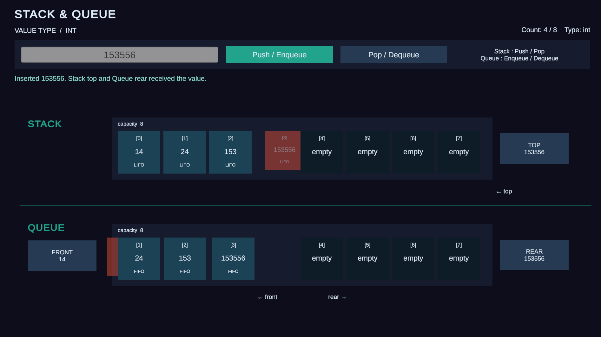
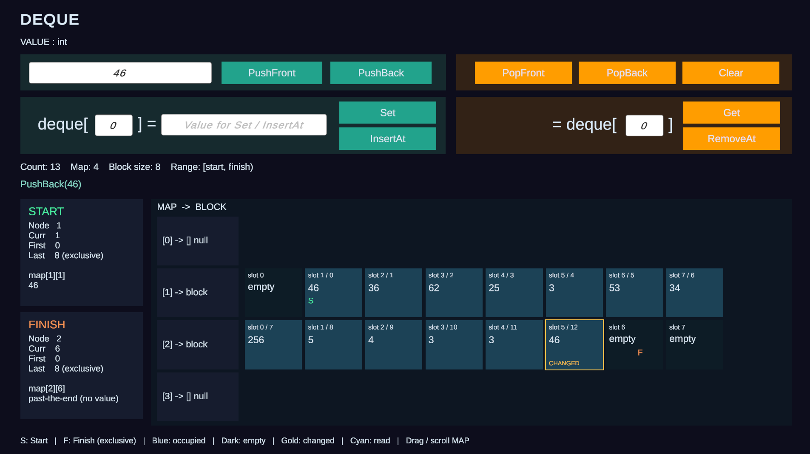
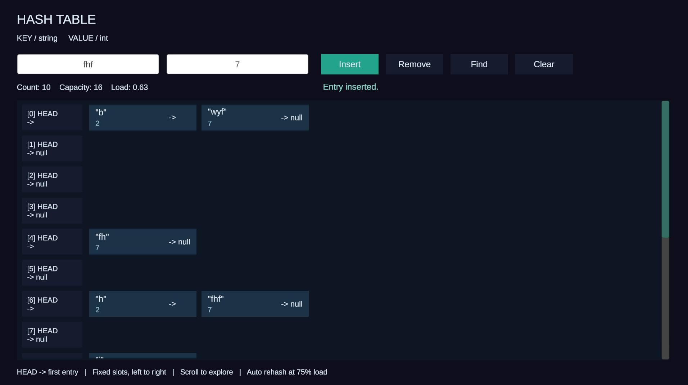
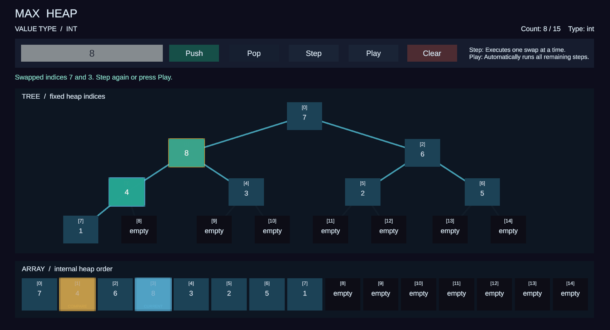
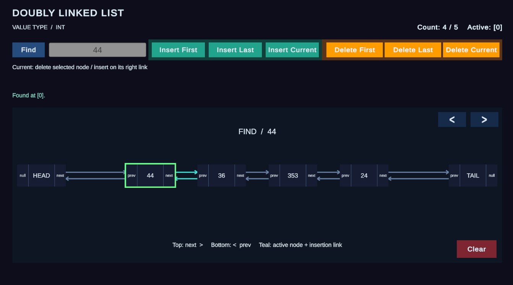

# Structura

스택, 큐, 덱, 해시테이블, 힙, 이중 연결 리스트의 내부 동작을 직접 조작하며 눈으로 확인하는 Unity 자료구조 시각화 프로젝트입니다.

**🎮 데모: https://jiyeonjeong01.github.io/Structura/**

## 자료구조

각 씬은 로비(`LobyScene`)에서 선택해 진입할 수 있으며, 삽입/삭제 등 연산을 버튼으로 직접 실행하면서 내부 상태 변화(인덱스, 포인터, 슬롯 등)를 실시간으로 확인할 수 있습니다.

| 자료구조 | 씬 | 스크린샷 |
| --- | --- | --- |
| Stack / Queue | `Assets/Scenes/Stack_Queue.unity` |  |
| Deque | `Assets/Scenes/DequeScene.unity` |  |
| Hash Table | `Assets/Scenes/HashTableScene.unity` |  |
| Heap | `Assets/Scenes/HeapScene.unity` |  |
| Doubly Linked List | `Assets/Scenes/DoublyLinkedListScene.unity` |  |

## 기술 스택

- Unity 6000.3.20f1
- C#
- WebGL 빌드, GitHub Actions + GitHub Pages로 자동 배포

## 로컬에서 열기

1. Unity Hub에서 `6000.3.20f1` 에디터로 프로젝트를 엽니다.
2. `Assets/Scenes/LobyScene.unity`를 열고 Play 합니다.
3. 각 자료구조 씬을 직접 다시 구성하려면 `Structura` 메뉴의 씬별 Build 명령을 사용합니다 (예: `Structura > Build Deque UI`).

## 배포

`main` 브랜치에 push하면 GitHub Actions가 자동으로 WebGL 빌드를 수행하고 결과물을 GitHub Pages(`https://jiyeonjeong01.github.io/Structura/`)에 배포합니다. 워크플로 정의는 [`.github/workflows/webgl-build.yml`](.github/workflows/webgl-build.yml)에 있습니다.
